#Notatki z wykładów Technologie internetowe 2016

##Od czego zacząc tworzenie stron w języku HTML?

Na początek nazleży dokonac wyboru edytora tekstu, jajlepiej taki który wspiera i ułatwia wpisywanie znaczników w języku HTML. Praktycznie każdy edytor HTML oferuje:
* kolorowanie składni
* automatyczne zamykanie znaczników
* generatory

**UWAGA!**
>
W języku HTML wszystkie znaczniki muszą być pisane obowiązkowo małymi literami. Dlatego zalecam już od początku uczyć się waśnie tej zasady. 
>

###Jaki edytor wybrać?

Popularne dla Widows:
* Pajączek
* Core Editor
* Ager Web Editor
* Ed HTML
* HateML Pro
* JHTML
* kED
* PSPad
* Web Edit
* Notepad++

Popularne dla Linux:
* Bluefish
* gedit
* kate
* Quanta Plus
* SCREEM

Popularne dla MAC OS X:
* Smultron
* Bluefish
* Taco HTML Edit

Ja osobiście wybrałem do utworzenia mojej pierwszej strony internetowej program **NOTEPAD++** :smile:

* [Program można pobrać ze strony domowej ](https://notepad-plus-plus.org/download/v6.9.2.html)

####Na początek proponuję skonfigurować parę przydatnych opcji w programie :star:

1. Ustwienia\Kofigurator stylów\Dostępne style:*Obsidian*
2. Ustwienia\Kofigurator stylów\*Couier New* oraz należy wybrać odpowiedni dla siebie rozmiar czcionki
3. Ustwienia\Kofigurator stylów :dobrze jest też zaznaczyć opcje: *Używaj globalnego kroju czcionek* oraz *Używaj globalnego rozmiaru czcionek*


Przydatną funkcją może okazać się ustawienie interfejsu programu na język **angielski** :neckbeard: jest to pomocne przy nauce języka angielskiego, którego niestety nie unikniemy programując w HTML.

Zmiany języka dokonujemy w: *Ustawienia\Preferencj\Lokalizacja\English*


Gdy już mamy otworzony nowy dokument, to **najważniejsze**, należy zapisać go jako typ dokumentu HTML, czyli np. z roższeżeniem *.html, podstawowym plikiem w którym zaczynamy pracę, jest plik index.html

##I co dalej? :alien:

Niestety napotykamy niezłą ścianę :scream:

Poza notatkami z wykładów i ćwiczeń z Technologii internetowych wzorowałęm się na kursach HTML dosepnych w internecie, najbardziej pomocny dla nie był kanał na  YouTube z kuresm HTML i CSS **Mirosława Zelenta**

[Kurs HTML odc.1: Tworzenie stron www - pierwszy projekt, wiedza podstawowa
Pasja informatyki ](https://www.youtube.com/watch?v=k2IydkL3EOs)

Ten i kolejne odcinki są naprawdę pomocene w tej nierównej walce.

##Kolejne etapy tworzenia własnej strony internetowej:

1. Definiujemy typ dokumentu i tworzymy sekcję **head** , tak naprawdę nie widoczną w widoku strony internetowej, ale szalenie ważną w kwestii poprawnego działania i wyświetlania witryny** :imp:

```
<!DOCTYPE HTML>
<html lang="pl"> 
<head>
	<meta charset="utf-8" />
	<title>Tytuł strony</title>
	<meta name="description" content="Tutaj wpisujemy czego dotyczyć będzie strona "/>
	<meta name="keywords" content="tutaj wpisujemy słowa kluczowe, związane z tematyką strony, 
	ważne przy pozycjonowaniu strony przez przeglądarki"/>
	<meta http-equiv="X-UA-Compatible" content="IE=edge,chrome=1"/>
	<meta name="author" content="Dane autora, chyba nie jest to pole obligatoryjne"/>
	<link rel="stylesheet" href="style.css" type="text/css" />
</head>

</html>

```
2. Wstawiamy sekcję **body**  za znacznikiem 

``` 
</head>
```
ale przed zamknięciem znacznika
```
</html>
```
,to wniej będą znajdowały się wszystkie elementy widoczne na stronie:

```
<body>
<div id="container">

	<div id="logo">
	Tekst, linki, zdjęcia, inne..  
	</div>
	
	<div id="menu">
	Linki do podstron
	</div>
	
	<div id="topbar">
	Pasek górny
	</div>
	
	<div id="sidebar">
	Pasek boczny
	</div>
	
	<div id="content">
	Tekst, linki, zdjęcia, inne..
	</div>
	
	<div id="footer">
	Stopka
	</div>
	
</div>
</body>
```
Ja oparłem strukturę strony na blokach **div**, wenątrz każdego bloku będą dodawane kolejne elementy np. linki, logo, zdjęcia, tekst, tabele itp., można też wykonać stronę opartą na strukturze tabeli, ale kod jest mniej przejrzysty i trudniej jest później na gotowej stronie szybko zmienić jej strukturę. Innych metod nie będę opisywał, ponieważ ich dobrze nie poznałem.

3.  Formatowanie stylu strony za pomocą kodów CSS 

* za pomocą komend wpisanych bezpośrednio w HTML
* za pomocą linku, odwołania do odrębnego pliku z zapisanymi kodami CSS, **wygodniejsze i praktyczniejsze ze względu na możliwość szybkiej zmiany stylu strony bez ingerencji w plik index.html

```
<link rel="stylesheet" href="style3.css" type="text/css"/>
```
Pozwyższy link wstawiamy w sekcji head :fire:

Ja skożystałem z podlinkowanego pliku z kodami CSS, wktórym opisane są min. kolor tła, rodzaj czcionki, wysokośći szerokość div(bloków), marginesy, ramki, zachowanie się kursora, itp. 
```
#body
{
	background-color: #404040;
	font-family: 'Lato', sans-serif;
}

#container
{
	width: 1000px;
	margin-left: auto;
	margin-right: auto;
}

#logo
{
	color: white;
	margin-top: 20px;
	font-size: 44px;
	letter-spacing: 3px;
	font-weight: 900;
}

#menu
{
	background-color: #303030;
	margin-top: 20px;
	color: #ffffff;
	padding: 10px;
	
}

#topbar
{
	background-color: #128870;
	color: white;
	padding: 10px;
	margin-top: 20px;
	margin-bottom: 25px;
	height: 170px;

```

**Ważne** należy się odwołać w pliku html w odpowiednim divie do okrelonego stylu poprzez zastosowanie zapisu: 

```
<div id="logo">
```
>
Zapis ten odwołuje się do stylu logo zapisanego w pliku CSS
>
 
#Pozostałe przydatne informacje  
 
 * wstawianie linków do zdjęć lokalnych, w katalou, lub na innej stronie internetowej, poprzez wykorzystanie zdjęcia jako linku
 
```
<a href="http://water.usgs.gov/edu/watercyclepolish.html" title="Obieg wody w przyrodzie"> 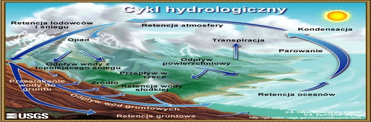

```

* wstawianie tabel w HTML, dla przykładu tabela z mojej strony która pełni funkcję galerii, całość umieszczona jest w divie **galeria** 


Poniżej wycinek kodu, który pokazuje jak taką tabelę stworzyć:

```
<div id="galeria">
	
	<span class="bigtitle">Galeria</span>
	<div style="height:15px;"></div>
	<div class="dottedline"></div>
	
	<table>
<tr>
	<td><a href="img/1.jpg" title="Odtworzony staw rybny">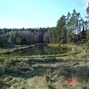</td>	
	<td><a href="img/2.jpg" title="Bagno">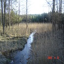</td>
	<td><a href="img/3.jpg" title="Jezioro Białe Błota">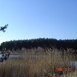</td>
	<td><a href="img/4.jpg" title="Zasilanie kanału Czarnowodzkiego - rzeka WDA">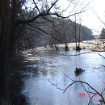</td>
	<td><a href="img/5.jpg" title="Rów zasilający odtworzone stawy i bagna">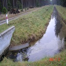</td>
</tr>
<tr>
	<td><a href="img/6.jpg" title="Kanał Czarnowodzki">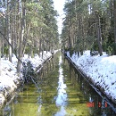</td>
	<td><a href="img/7.jpg" title="Bagno śródleśne">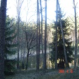</td> 
	<td><a href="img/8.jpg" title="Bagno śródleśne">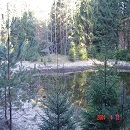</td> 
	<td><a href="img/9.jpg" title="Rów zasilający odtworzone stawy i bagna">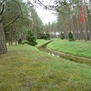</td> 
	<td><a href="img/10.jpg" title="Jezioro Białe Błota z pływającą wyspą">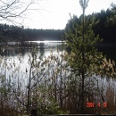</td>
</tr>
<tr>
	<td><a href="img/11.jpg" title="Kanał Czarnowodzki">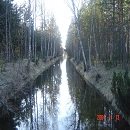</td>	
	<td><a href="img/12.jpg" title="Jezioro Niedzwiadki">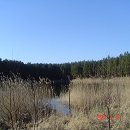</td> 
	<td><a href="img/13.jpg" title="Wodowskaz i pływająca wyspa na jeziorze Białe Błota">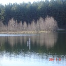</td> 
	<td><a href="img/14.jpg" title="Zasilanie stawu wodą - studnia artezyjska">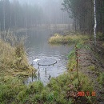</td> 
	<td><a href="img/15.jpg" title="Ujęcie wody/przepust z Kanału Czarnowodzkiego">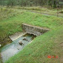</td>
</tr>
</table>
	</div>
```

* Poiżej przedstwię jeszcze listę najbardziej przydatnych znaczników w języku XHTML/HTML ze strony [Pordnik- Webmastera](http://www.poradnik-webmastera.com/polecenia/html/znaczniki/)


| Tables        | Are           | Cool  |
| ------------- |:-------------:| -----:|
| col 3 is      | right-aligned | $1600 |
| col 2 is      | centered      |   $12 |
| zebra stripes | are neat      |    $1 |


###Linki:
1. [Sobakowy blog](http://sobak.pl/blog/markdown-czyli-wygodne-formatowanie-tekstu/), krótki opis języka Markdown. 
2. [ASP Katowice](http://www.asp.katowice.pl/zobacz/markdown#lists), Markdown na ASP Katowice. 
3. [Projekt ML]( http://lewand16.github.io/TI2016), Link do mojej strony na Github.


#Wykład 16.04.2016

[Kurs blendera](http://polskikursblendera.pl/)

[Matematyka UG](https://math.ug.edu.pl/)

##github pages, zalety stron na github to min.:

*responsywność*, jak się je ogląda na tabletach i smartfonach to działa poprawnie,

- lepiej stronę trzymać w chmurze, np. github, można podmienić na swój szablon, komunikacja z rzeczami w chmurze tomoże być problem,

- powinniśmu mieć coś np. terminal, lub github desktop, co pozwoli

- do tworzenia stron używamy edytora, może być **ATOM

- mamy rzeczy u siebie na dysku, można zrobić klony repozytorium
  tam można poprawiać, dodać tekst, potem wrzucamy to zpowrotem

- należy zwracać uwagę na używane przyciski

##konsola,polecenia:

- ls
- git push #ściąganie danych
- git pull #wysyłanie danych, wysyła to co zostało zmienione
- tree -git/ # wyświetla drzewo plików z naszego repozytorium
- git clone adres

*różnica jest nakładana można scalić*

##GITLAB
- tam można zakłądać konta prywatne i mikt nie sklonuje naszego repozytorium,ale jednak trzymamy się repopublicznych

##mechanizm kluczy publicznych
- przetrwać z unixem/secure shell SSH, bezpieczny sposób komunikacji, 2 klucze publiczny i prywatny, 2 duże liczby pierwsze no   i już.

[środowisko programisty/ przetrwać z unixem, strona naszego prowadzącego](wbzyl.inf.ug.edu.pl) 

##kryptografia - Turing

1. klucz się generuje/podgląd kluczy z konsoli, można je znaleźć raczej po wyświetleniu poleceniem ls,:
- tree -/.ssh/id_rsa.pub #wyświetla klucz publiczny
- tree -/.ssh/known_hosts
- trzeci którego nie spisałem, ale chodzi o prywatny

2. generowane są 3 pliki przez program do ssh, czyli klucz prywatny, publiczny, i known hosts

3. Windows, należy dograć secure shell

##CSS
- powiązany z html, zmienia wygląd, mapowanie na wygląd, polega na grnerowaniu automatycznym
- najlepszy wybór w html to lista ul
- gotowy html z klasami mamy i jakiś css, ale chcemy trochę pozmieniać, jak to działą?:
  znacznik body, tworzony jest przez ileś reguł

**Należy w naszej stronie dołożyć ramki**

- css3 umożliwia robienie robienie szlaczków
- w3c - konsorcjum od www, 
- w3c css3 wyszukać w przeglądarce, na stronie szukamy borders
- dowolne zdjęcie można wrzucić i przerobić je na ramkę

##zrób to sam 
- idziemy na link i próbujemy wpisywać kod
1. [Ćwiczymy html i css](http://codepen.io/pen/)

*robimy ramkę*
```
<div class+"bi"............
```
####css trics border image - szukamy trików w przeglądarce do ramek na stronie

*KONIEC*

